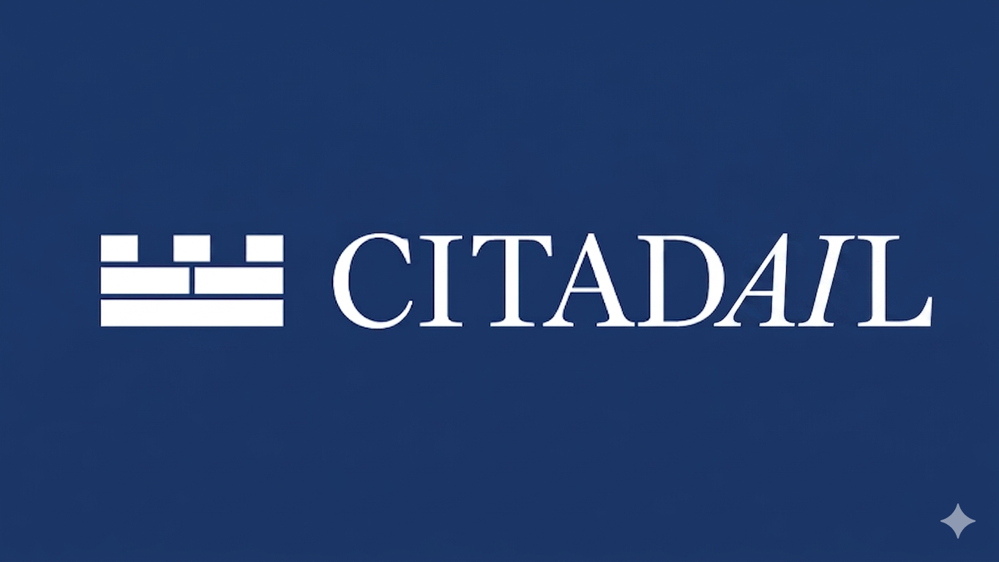
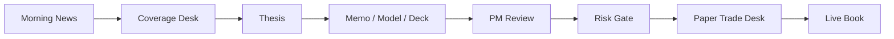

# Citadail

<p align="center">
  
</p>

<p align="center">
  <strong>AI-native equity research and paper-desk workflow OS.</strong>
</p>

<p align="center">
  
  
  
  
  
  
  
</p>

Citadail helps an analyst or PM move from market context to a source-backed thesis, real Office artifacts, PM review, risk approval, and paper-position monitoring. It is not just "chat with AI about stocks"; it is an end-to-end research workflow system for paper-portfolio experimentation.

**Quick nav:** [Demo](#demo) · [Features](#core-features) · [Quick Start](#quick-start) · [Architecture](#architecture) · [Safety](#safety-boundaries) · [Docs](#docs)

## Demo

[](https://youtu.be/pSyjZ7d7w5s)

[Watch the Citadail demo](https://youtu.be/pSyjZ7d7w5s)

## What Is Citadail?

Citadail is an experimental equity research and paper-desk workspace. It combines a human-guided research workbench, generated analyst deliverables, a PM/risk workflow, a paper Trade Desk, a Live Book, a historical Full Auto replay engine, and optional command/runtime layers for Spectrum and Dedalus/OpenClaw.

The product is designed around process discipline: every thesis needs evidence, assumptions, catalysts, risks, invalidation triggers, PM review, and risk review before it reaches the paper desk.

## Core Workflow



## Core Features

- **Morning News**: market context, index snapshots, macro cues, headlines, and screeners.
- **Coverage Desk**: ticker search, watchlist, current coverage, and flagged names.
- **Thesis Builder**: recommendation and rationale capture for a selected company.
- **Memo / Model / Deck exports**: real DOCX, XLSX, and PPTX analyst artifacts.
- **PM Review**: decision packet for approving, sending back, or rejecting a thesis.
- **Risk Gate**: paper-desk risk acceptance, sizing discipline, and risk status.
- **Trade Desk**: paper-only open, add, trim, exit, and recheck actions.
- **Live Book**: active paper book, thesis pipeline, attention items, and risk buckets.
- **Full Auto historical replay**: walk-forward simulated desk using timestamped historical sources.
- **Spectrum/iMessage command layer**: PM-style commands for brief, book, positions, artifacts, and runtime status.
- **Dedalus/OpenClaw runtime proof path**: optional machine-backed Full Auto step execution with local fallback.

## Quick Start

```bash
cd frontend
npm install
npm run dev
```

The app runs at `http://localhost:3000`.

## Environment Variables

Copy `.env.example` into `frontend/.env.local` for local development:

```bash
cp .env.example frontend/.env.local
```

Common variables:

- `GEMINI_API_KEY`: server-side Gemini key for AI-backed project generation and optional search grounding.
- `SEC_USER_AGENT`: recommended SEC identity string for source collection workflows.
- `DEDALUS_API_KEY`: optional server-side Dedalus key for machine-backed runtime proof.
- `DEDALUS_MODEL`: optional model id for Dedalus/OpenClaw runtime metadata.
- `PERPLEXITY_API_KEY`: optional source/news enrichment.
- `PHOTON_PROJECT_ID` / `PHOTON_PROJECT_SECRET`: optional Spectrum/iMessage bridge credentials.
- `SPECTRUM_USE_TERMINAL`: use terminal mode for local Spectrum testing.

See [.env.example](.env.example) and [frontend/README.md](frontend/README.md) for the full environment surface.

## Verification

```bash
cd frontend
npm run lint
npm run test:shell
npm run build
```

## Architecture

Citadail is a Next.js application with three connected layers:

- **Workbench layer**: browser UI for sessions, theses, artifacts, PM/risk decisions, paper positions, and the Live Book.
- **Desk runtime layer**: API routes and local/server libraries for project generation, Office export, Full Auto replay, and paper-desk state.
- **Ambient command/runtime layer**: Spectrum commands plus optional Dedalus/OpenClaw machine-backed replay proof.

Detailed architecture, API routes, runtime diagrams, and data-flow notes live in [docs/ARCHITECTURE.md](docs/ARCHITECTURE.md).

## Safety Boundaries

Citadail has explicit safety boundaries:

- No brokerage integration.
- No live order routing.
- No real capital movement.
- All positions are paper-only.
- Historical replay avoids future-data access by filtering on `knownAt`.
- Remote runtime commands are allowlisted.
- Secrets stay on the server or local agent and are never intentionally sent to the browser client.

Read the detailed safety model in [docs/SAFETY.md](docs/SAFETY.md).

## Project Status / Roadmap

Citadail is an experimental, hackathon-origin project suitable for local development, demos, research workflow exploration, and paper-portfolio simulations. It is not production financial software.

Roadmap:

- Portfolio-wide book.
- Durable backend persistence.
- Clearer source freshness labels.
- Better artifact styling.
- Full voice/Spectrum integration.
- Hosted demo.
- Contributor-friendly issues.

## Docs

- [Product](docs/PRODUCT.md)
- [Architecture](docs/ARCHITECTURE.md)
- [Full Auto](docs/FULL_AUTO.md)
- [Spectrum](docs/SPECTRUM.md)
- [Dedalus/OpenClaw](docs/DEDALUS_OPENCLAW.md)
- [Safety](docs/SAFETY.md)
- [Artifacts](docs/ARTIFACTS.md)
- [Frontend developer guide](frontend/README.md)

## Contributing

Contributions are welcome through focused issues and pull requests. Start with [CONTRIBUTING.md](CONTRIBUTING.md), follow [CODE_OF_CONDUCT.md](CODE_OF_CONDUCT.md), and report security concerns through [SECURITY.md](SECURITY.md).

## Disclaimer

Citadail is for research, education, workflow simulation, and paper-portfolio experimentation only. It is not financial advice, investment advice, brokerage software, or a live trading system.
