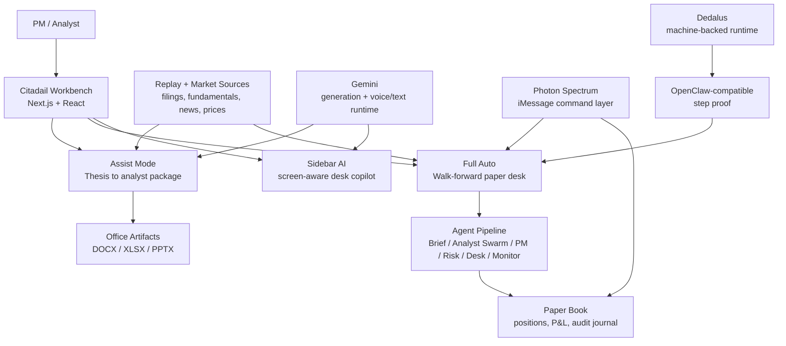
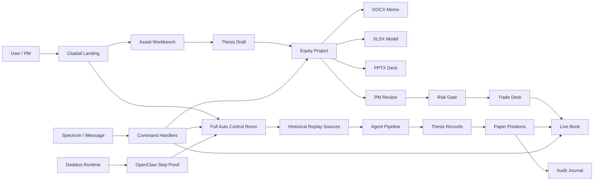
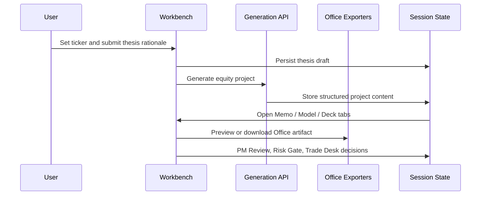
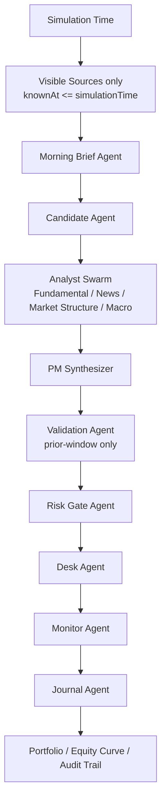
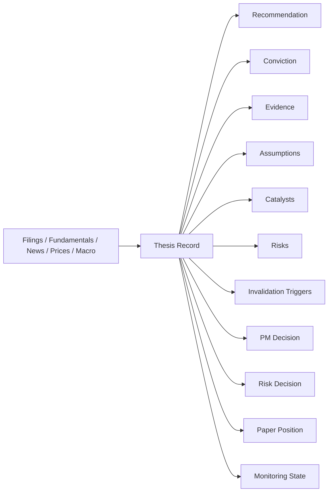
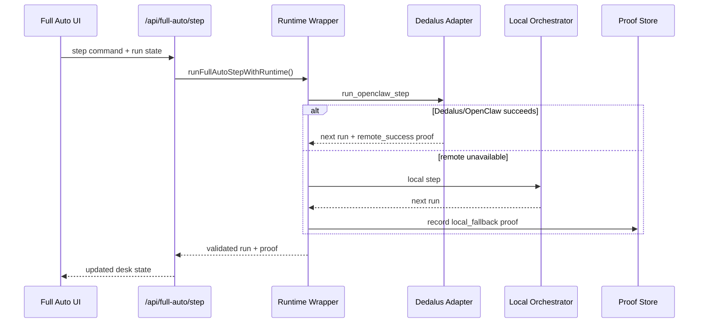

# Citadail

Citadail is an AI-native equity research desk for building, reviewing, executing, and monitoring medium-horizon equity theses. It combines a research workbench, real analyst deliverables, a walk-forward paper-investing simulation, an iMessage command layer, and a machine-backed runtime proof surface.

The product is intentionally not a retail investing assistant, not a live brokerage terminal, and not an autonomous live trader. Citadail is a paper-only research and desk operating system.

## Stack At A Glance



## Core Loop

1. Start in Assist Mode or Full Auto Mode.
2. In Assist Mode, select a ticker, choose a recommendation, and submit a rationale.
3. Generate the institutional package: memo, operating model, and PM pitch deck.
4. Move the idea through PM Review, Risk Gate, Trade Desk, and Live Book.
5. In Full Auto, run a historical walk-forward desk: morning brief, candidate selection, analyst agents, PM/risk checks, paper positions, monitoring, and journaled decisions.

## Product Surfaces

- **Landing**: mode selection, sponsor/runtime visual story, and entry into Assist or Full Auto.
- **Morning News**: market context, sentiment, and headline screeners.
- **Coverage Desk**: ticker search, current coverage, watchlist, and flagged names.
- **Thesis**: recommendation capture and rationale submission.
- **Memo**: generated investment memo preview and DOCX export.
- **Model**: generated operating model preview and XLSX export.
- **Deck**: generated PM pitch deck preview and PPTX export.
- **PM Review**: compressed decision packet for capital approval.
- **Risk Gate**: size, downside, and risk acceptance screen.
- **Trade Desk**: single-position paper trade view.
- **Live Book**: portfolio-level monitor for active theses and paper positions.
- **Full Auto**: continuous walk-forward paper desk from 2022 onward.
- **Spectrum Agent**: iMessage/terminal command layer for PM-style interaction.

## Technical Architecture

Citadail is a Next.js application with three connected operating layers:

- **Workbench layer**: the browser UI where users inspect theses, artifacts, positions, and the book.
- **Desk runtime layer**: local/server APIs that generate artifacts, step Full Auto, persist state, and enforce paper-only workflow rules.
- **Ambient command layer**: Spectrum/iMessage commands that let a PM ask for the brief, book, runtime status, ticker news, or artifacts outside the web UI.



## Execution Modes

### Assist Mode

Assist Mode is the human-guided workflow. The user chooses the ticker and recommendation, then Citadail builds the analyst package and moves the idea through the investment process.



Assist Mode centers on an `EquityProject`, which contains:

- ticker
- recommendation
- rationale
- project status
- generated content
- memo/model/deck artifact metadata
- PM Review state
- Risk Gate state
- paper position state

### Full Auto Mode

Full Auto is a historical walk-forward paper desk. It starts from a fixed replay date, reads only data known at the current simulation time, and evolves a paper book through time.



Each Full Auto step is bounded. It advances one simulated day or event window, runs the agent chain, updates paper positions, marks thesis health, and writes an audit trail. The system does not call live search during replay. External source import is separate from replay execution.

Full Auto persistent objects:

- `FullAutoRun`: the simulation container.
- `HistoricalSource`: timestamped replay source with `knownAt` filtering.
- `ThesisRecord`: central investment object produced by the agent pipeline.
- `FullAutoPaperPosition`: paper-only desk position linked to a thesis.
- `FullAutoJournalEntry`: audit trail of every material decision.
- `OpenClawExecutionProof`: proof that a replay step was executed through the machine-backed runtime or safely fell back locally.

## Thesis Record

Everything important converges into a `ThesisRecord`.



A thesis is not complete unless it says what would break it. Falsification is treated as a first-class output, not an afterthought.

## Office Artifact Generation

Citadail generates real Office files, not fake text tabs:

- `Investment Memo.docx`
- `Operating Model.xlsx`
- `PM Pitch Deck.pptx`

Generation flow:

1. `/api/equity/project/generate` creates structured analyst content from the submitted thesis and available company context.
2. `/api/equity/project/preview` renders browser previews for memo/model/deck tabs.
3. `/api/equity/project/export` emits binary Office files with the correct MIME type and attachment headers.

Office libraries:

- `docx` for memo export.
- `exceljs` for operating model export.
- `pptxgenjs` for PM deck export.

The model is designed to show the numbers behind the story: revenue assumptions, margins, valuation output, sensitivity, comps, and risk triggers.

## Spectrum / iMessage Layer

Citadail includes a TypeScript Spectrum agent for PM group-chat workflows.

Entry point:

- `frontend/scripts/spectrum-agent.ts`

Core modules:

- `frontend/lib/citadail-spectrum-command.ts`
- `frontend/lib/citadail-spectrum-handler.ts`
- `frontend/lib/spectrum-desk-state.ts`
- `frontend/lib/spectrum-desk-visuals.ts`

The Spectrum layer supports PM-friendly commands such as:

- `Citadail brief`
- `Citadail book`
- `Citadail positions`
- `Citadail thesis NVDA`
- `Citadail news AAPL`
- `Citadail runtime`
- `Citadail run machine step`
- `Citadail deck NVDA`

Group-chat safety:

- In group chats, the agent responds only to prefixed commands such as `Citadail ...` or `cd ...`.
- In direct messages, plain commands are accepted.
- Duplicate message ids are ignored.
- Trade language is always paper-only.

## Dedalus + OpenClaw Runtime Proof

Citadail uses Dedalus as a machine-backed persistence and execution proof layer. The local app remains reliable, but Full Auto can attempt a machine-backed OpenClaw-compatible replay step.

Demo line:

> Citadail executes Full Auto replay steps through a machine-backed OpenClaw runtime on Dedalus, persists the resulting desk state and proof, and safely falls back to local execution if the runtime is unavailable.

Runtime modes:

- **Machine-backed**: strict remote OpenClaw step through Dedalus.
- **Hybrid fallback**: try Dedalus/OpenClaw first, then fall back to local step if unavailable.
- **Local**: run the replay step entirely in the app runtime.

Proof flow:



Proof surfaces:

- Full Auto signal toast: `Executed by OpenClaw on Dedalus`.
- Runtime status command in Spectrum.
- Latest proof history stored locally for UI and command responses.
- Machine state sync path on Dedalus: `/home/machine/citadail/state/`.

The browser never receives Dedalus secrets and never exposes arbitrary shell execution.

## API Surface

| Route | Purpose |
| --- | --- |
| `GET /api/market/brief` | Morning News data surface. |
| `POST /api/equity/project/generate` | Generate structured analyst project content. |
| `POST /api/equity/project/preview` | Render artifact previews for the workbench. |
| `POST /api/equity/project/export` | Export DOCX/XLSX/PPTX files. |
| `GET /api/full-auto/run` | Read shared Full Auto run state. |
| `POST /api/full-auto/run/reset` | Reset the Full Auto demo state. |
| `POST /api/full-auto/step` | Advance one bounded Full Auto step. |
| `POST /api/full-auto/open-session` | Bridge a Full Auto thesis into the normal workbench. |
| `GET /api/dedalus/runtime` | Read sanitized Dedalus/OpenClaw runtime status. |
| `POST /api/dedalus/runtime` | Run allowlisted runtime actions only. |
| `POST /api/desk/chat` | Sidebar AI chat with screen/context snapshot tools. |
| `GET /api/voice/token` | Gemini Live voice/text token route. |

## State And Persistence

Citadail uses a deliberately simple persistence model for the hackathon build:

- Browser/session state for the workbench and local UI cache.
- File-backed runtime state for Spectrum and shared Full Auto state.
- Optional Dedalus machine-backed state sync for runtime proof.

Important runtime files are ignored and should not be committed:

- `frontend/.env.local`
- `frontend/.citadail/runtime/*.json`
- `.next/`
- `node_modules/`

## Safety Boundaries

Citadail is built around explicit guardrails:

- Paper positions only.
- No brokerage connection.
- No live execution claims.
- No future-data access during historical replay.
- Replay sources are filtered by `knownAt <= simulationTime`.
- Perplexity is used only for import/enrichment, not inside the walk-forward replay loop.
- Dedalus actions are allowlisted; no browser-exposed arbitrary command execution.
- Spectrum group chat requires command prefixes to avoid noisy or accidental responses.

## Repo Map

```text
frontend/
  app/
    page.tsx                         Landing
    full-auto/page.tsx               Full Auto route
    sessions/[id]/page.tsx           Assist workbench route
    api/                             Server routes
  components/
    session-workspace.tsx            Main tabbed workbench
    full-auto-control-room.tsx       Full Auto dashboard
    coverage-desk.tsx                Coverage Desk
    thesis-tab.tsx                   Thesis entry
    equity-project-artifact-tab.tsx  Memo/model/deck previews
    pm-review-tab.tsx                PM Review
    risk-gate-tab.tsx                Risk Gate
    trade-desk-tab.tsx               Single-position desk view
    live-book-tab.tsx                Portfolio-level view
    signal-toast-stack.tsx           Demo proof toasts
  lib/
    equity-project*.ts               Project generation and state
    equity-office-*.ts               Office previews and exports
    full-auto-*.ts                   Replay data, agents, orchestration, runtime
    dedalus-runtime.ts               Machine-backed runtime adapter
    citadail-spectrum-*.ts           Spectrum command parser/handler
    session-*.ts                     Session storage, routing, update pipeline
  tests/
    *.test.ts(x)                     Vitest coverage for shell, Full Auto, exports, Spectrum, Dedalus
```

## Environment Variables

Create `frontend/.env.local` for local development. Do not commit this file.

```bash
GEMINI_API_KEY=...
OPENAI_API_KEY=...
PERPLEXITY_API_KEY=...

PHOTON_PROJECT_ID=...
PHOTON_PROJECT_SECRET=...
SPECTRUM_USE_TERMINAL=false
CITADAIL_APP_URL=http://localhost:3000

DEDALUS_API_KEY=...
DEDALUS_DCS_BASE_URL=https://dcs.dedaluslabs.ai
DEDALUS_API_BASE_URL=https://api.dedaluslabs.ai
DEDALUS_MODEL=openai/gpt-5
```

Only server routes and local scripts read these secrets. Client code receives sanitized status and generated outputs only.

## Quick Start

```bash
cd frontend
npm install
npm run dev
```

Open `http://localhost:3000`.

Run the Spectrum agent locally:

```bash
cd frontend
npm run spectrum:agent
```

## Verification

```bash
cd frontend
npm run lint
npm run test:shell
npm run build
```

The core regression suite covers:

- shell/session behavior
- Coverage Desk
- thesis submission
- Office export smoke checks
- Full Auto orchestration
- Dedalus runtime fallback/proof behavior
- Spectrum command parsing and responses
- sidebar AI chat context handling
- Gemini reconnect policy

## Deployment Note

The complete Citadail app requires a server runtime because it uses API routes for Office exports, generation, Full Auto stepping, Spectrum state, and Dedalus status. A static GitHub Pages preview can show the landing page and product framing, but the full interactive desk should be deployed to a server-capable host.
