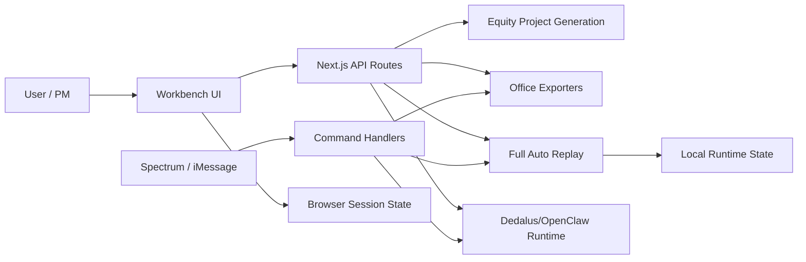
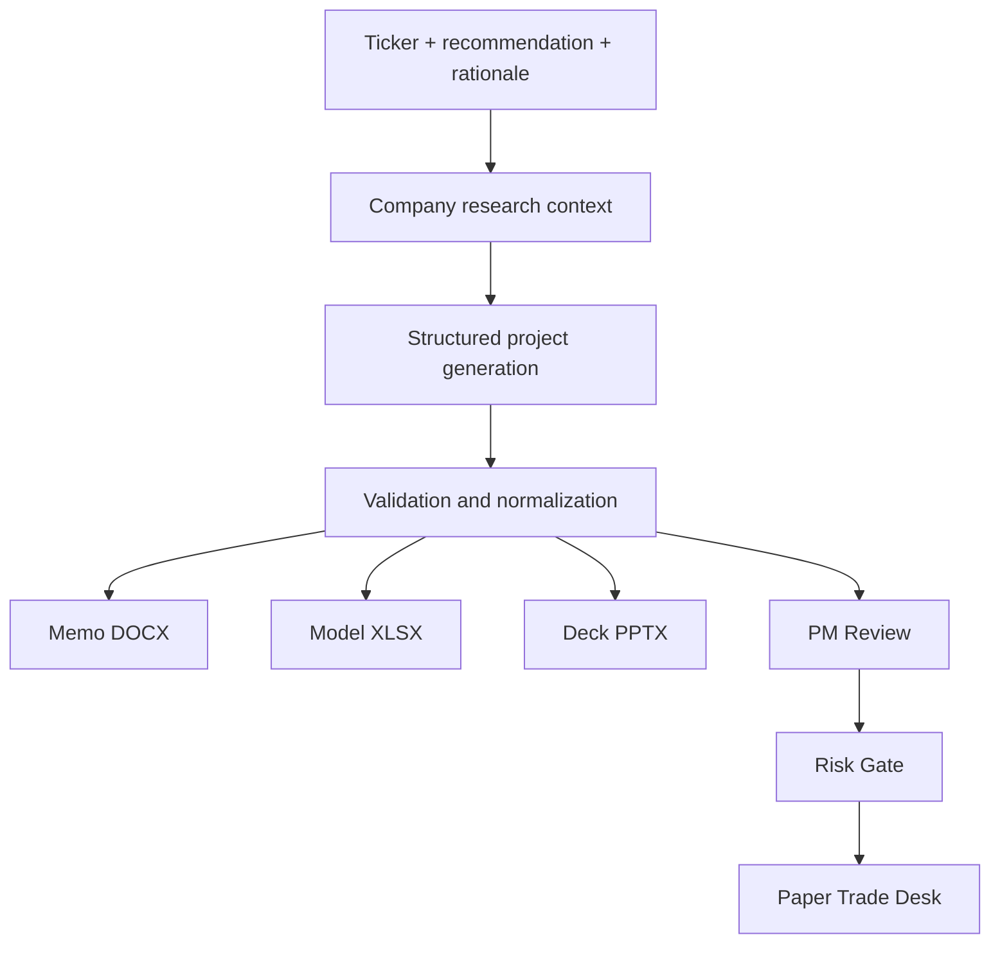

# Architecture

Citadail is a Next.js application with a browser workbench, server/local APIs, a historical replay engine, generated Office artifacts, and optional command/runtime integrations.

## Layers

## Workbench Layer

The browser workbench owns the human-guided research flow:

- session list and active session;
- selected ticker and thesis draft;
- generated project state;
- artifact previews and downloads;
- PM Review and Risk Gate state;
- paper position state;
- transcript/sidebar context.

Key files:

- `frontend/components/session-workspace.tsx`
- `frontend/lib/session-storage.ts`
- `frontend/lib/session-repository.ts`
- `frontend/lib/workspace-tabs.ts`
- `frontend/types/session.ts`

## API Surface

Primary routes:

- `/api/market/brief`: Morning News data.
- `/api/equity/project/generate`: create structured analyst content.
- `/api/equity/project/preview`: build browser previews for memo/model/deck.
- `/api/equity/project/export`: export DOCX, XLSX, or PPTX.
- `/api/desk/chat`: right-sidebar assistant response.
- `/api/voice/token`: Gemini Live ephemeral token.
- `/api/full-auto/step`: advance Full Auto locally, hybrid, or via Dedalus/OpenClaw.
- `/api/full-auto/run`: load shared Spectrum/Full Auto run state.
- `/api/full-auto/run/reset`: reset shared Spectrum/Full Auto state.
- `/api/full-auto/open-session`: validate a Full Auto thesis before session import.
- `/api/dedalus/runtime`: inspect or operate the optional machine-backed runtime.

## State Model

Citadail uses two main state worlds.

**Assist/session state** is browser-local and stores user workspaces, generated projects, PM/risk decisions, paper positions, and transcripts.

**Full Auto/Spectrum state** is server/local-runtime state stored under `.citadail/runtime` by default. It stores the active replay run, Spectrum processed message ids, proactive feed state, audit trail, and Dedalus proof metadata.

## Equity Project Flow

## Source Layer

The research source layer can use:

- cached source packs;
- SEC company facts and filings;
- Yahoo market/profile/news data;
- Google News RSS;
- optional Gemini-grounded search;
- optional Perplexity enrichment in specific paths.

The design goal is to avoid pretending that unavailable data exists. AI-backed generation should fail loudly when required context or credentials are unavailable.

## Runtime Layer

Full Auto can step through three modes:

- `local`: deterministic local replay.
- `hybrid`: try Dedalus/OpenClaw, then fall back locally.
- `dedalus_openclaw`: require machine-backed OpenClaw execution.

The remote command vocabulary is intentionally narrow: `start`, `step`, and `pause`.

## Deployment Notes

The root `package.json` delegates build/start/dev/lint scripts into `frontend`. GitHub Pages currently deploys the static `pages-site` folder through `.github/workflows/pages.yml`.
