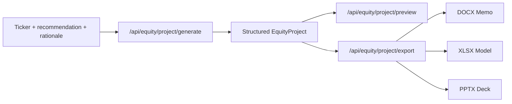

# Artifacts

Citadail generates real Office files for an equity project:

- investment memo as DOCX;
- operating model as XLSX;
- PM pitch deck as PPTX.

## Flow

## Generated Content

An equity project can include:

- company overview;
- recommendation summary;
- why now;
- what changed;
- market missing / variant perception;
- bull, base, and bear cases;
- catalysts;
- risks;
- invalidation conditions;
- memo sections;
- evidence;
- model assumptions;
- forecast rows;
- valuation;
- sensitivity;
- comps;
- risk triggers;
- trade proposal;
- deck slides;
- validation summary.

## Export Libraries

- `docx` for memo export.
- `exceljs` for operating model export.
- `pptxgenjs` for deck export.

## Preview Behavior

The preview route parses generated Office files back into browser-friendly structures:

- DOCX text and blocks;
- XLSX sheets, cells, formulas, and styling hints;
- PPTX slide text/layout and optional rendered slide images.

If local rendering dependencies are unavailable, the deck preview can fall back to parsed slide structure rather than image thumbnails.

## Main Files

- `frontend/lib/equity-project.ts`
- `frontend/lib/equity-project-generation.ts`
- `frontend/lib/equity-office-export.ts`
- `frontend/lib/equity-office-preview.ts`
- `frontend/components/equity-project-artifact-tab.tsx`
