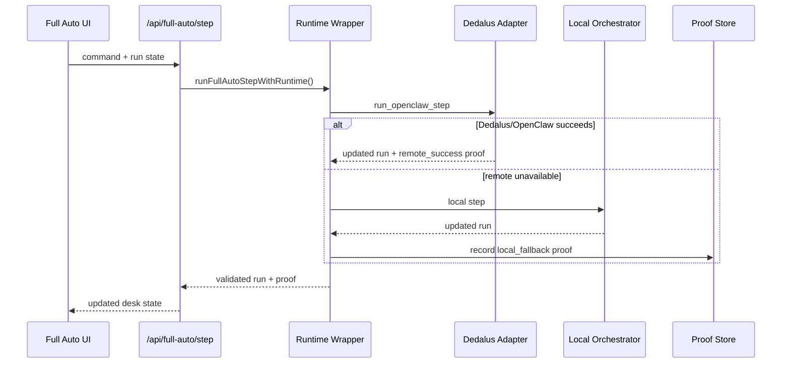

# Dedalus / OpenClaw

Citadail can optionally execute bounded Full Auto replay steps through a machine-backed OpenClaw-compatible runtime on Dedalus.

The local app remains functional without Dedalus. Hybrid mode attempts remote execution first and records a local fallback proof if the remote runtime is unavailable.

## Runtime Modes

- `local`: run the replay step entirely in the app runtime.
- `hybrid`: try Dedalus/OpenClaw first, then fall back locally.
- `dedalus_openclaw`: require the remote OpenClaw step.

## Command Vocabulary

The remote command vocabulary is intentionally narrow:

- `start`
- `step`
- `pause`

Other UI actions are mapped into this bounded vocabulary before reaching the remote worker.

## Proof Flow



## Remote State

The Dedalus worker writes machine state under:

```text
/home/machine/citadail/state/
```

Important files include the synced Full Auto run, runtime status, step input, and OpenClaw proof JSON.

## Secrets

Dedalus credentials are server-only. The browser calls API routes and receives sanitized status/proof data. It should not receive the Dedalus API key, machine credentials, or arbitrary shell access.

## Main Files

- `frontend/lib/dedalus-runtime.ts`
- `frontend/lib/full-auto-step-runtime.ts`
- `frontend/app/api/full-auto/step/route.ts`
- `frontend/app/api/dedalus/runtime/route.ts`
