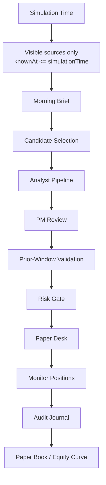

# Full Auto

Full Auto is Citadail's historical walk-forward paper desk. It simulates a research and portfolio process over time using only replay sources known at the current simulation timestamp.

It is not a live trading agent.

## Core Loop

## Main Objects

- `FullAutoRun`: simulation container, current time, portfolio, thesis records, journal, and agent events.
- `HistoricalSource`: timestamped replay source with `knownAt` and `asOfDate`.
- `ThesisRecord`: recommendation, conviction, variant view, evidence, assumptions, catalysts, risks, validation, PM/risk decisions, and paper-position link.
- `FullAutoPaperPosition`: paper-only position with entry, current mark, side, size, status, and rationale.
- `FullAutoJournalEntry`: audit event for decisions and desk actions.
- `OpenClawExecutionProof`: optional proof of remote or fallback step execution.

## Replay Discipline

Full Auto filters historical data by `knownAt <= simulationTime`. The replay should not use future filings, prices, or news while evaluating an earlier step.

Current replay data is curated in `frontend/lib/full-auto-historical-data.ts`. The replay end date is configured in the orchestrator, so product copy should clearly distinguish historical replay from current market data.

## Paper Book Rules

The default paper book rules include:

- starting paper capital of `$1,000,000`;
- max position size of `10%`;
- target gross exposure of `70%`;
- max gross exposure of `85%`;
- max open positions of `10`;
- cooldowns to avoid duplicate active theses in the same name.

Rules are implemented in `frontend/lib/full-auto-orchestrator.ts`.

## Validation Model

Prior-window validation checks whether comparable historical price behavior supports the thesis using only data visible at that simulation point. The output can be supportive, mixed, weak, or insufficient.

Validation is advisory. PM and risk logic still gate whether the idea reaches the paper desk.

## UI

The Full Auto control room lives in `frontend/components/full-auto-control-room.tsx` and includes:

- replay controls;
- date window settings;
- equity curve;
- agent activity feed;
- candidate queue;
- active positions;
- watch/revisit list;
- scorecard;
- audit journal;
- OpenClaw proof toasts.
