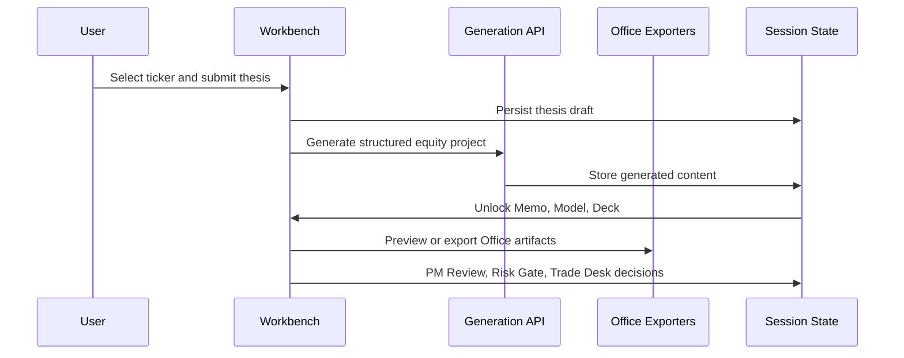

# Product

Citadail is an AI-native equity research and paper-desk operating system. It helps a user move from market context to a structured thesis, generated analyst artifacts, PM review, risk review, paper trade execution, and live-style book monitoring.

The product is intentionally not a retail investing chatbot. The design center is an investment workflow: a thesis must have evidence, assumptions, catalysts, risks, invalidation triggers, PM approval, and risk approval before it reaches the paper desk.

## Target User

- An analyst prototyping equity theses.
- A PM reviewing ideas and simulated desk decisions.
- A student or builder demoing research workflows.
- A user experimenting with paper-portfolio process design.

Citadail is not intended for live capital allocation, brokerage execution, or production investment operations.

## Product Surfaces

- **Landing / mode selection**: entry into Assist Mode or Full Auto.
- **Morning News**: market context, headlines, macro cues, and screeners.
- **Coverage Desk**: ticker search, coverage list, watchlist, and flagged names.
- **Thesis**: recommendation and rationale capture.
- **Memo**: generated investment memo preview and DOCX export.
- **Model**: generated operating model preview and XLSX export.
- **Deck**: generated PM pitch deck preview and PPTX export.
- **PM Review**: decision packet and approval/send-back/reject flow.
- **Risk Gate**: risk score, sizing guidance, risk decision, and paper-desk readiness.
- **Trade Desk**: paper-only open, add, trim, exit, and recheck actions.
- **Live Book**: position monitor, thesis pipeline, risk buckets, and attention items.
- **Full Auto**: historical walk-forward paper desk.
- **Spectrum Agent**: terminal/iMessage command layer.
- **Dedalus/OpenClaw**: optional remote runtime proof path.

## Assist Mode Flow

## Core Product Object

The central Assist object is an `EquityProject`. It contains:

- ticker;
- recommendation;
- rationale;
- generation status;
- generated content;
- memo/model/deck artifact metadata;
- PM Review state;
- Risk Gate state;
- paper position state.

Generated content includes the company overview, recommendation summary, why now, what changed, variant perception, bull/base/bear cases, catalysts, risks, invalidation conditions, evidence, assumptions, forecast, valuation, sensitivity, comps, trade proposal, and deck slides.

## Product Strengths

- End-to-end workflow rather than a single prompt/response loop.
- Real Office deliverables instead of simulated exports.
- PM and risk gates before desk action.
- Paper-only language and state model.
- Historical replay with timestamped source discipline.
- Multiple interaction surfaces: browser, Spectrum, and optional machine-backed runtime.

## Current Status

Citadail is experimental and hackathon-origin. It is suitable for local demos, workflow experiments, and paper-portfolio simulations. It is not production financial software.

## Roadmap

- Portfolio-wide book across all user sessions.
- Durable backend persistence.
- Clear source freshness labels.
- Better artifact styling and brand system.
- Full visible voice integration.
- Deeper Spectrum command coverage.
- Hosted demo.
- Contributor-friendly issues and project board.
